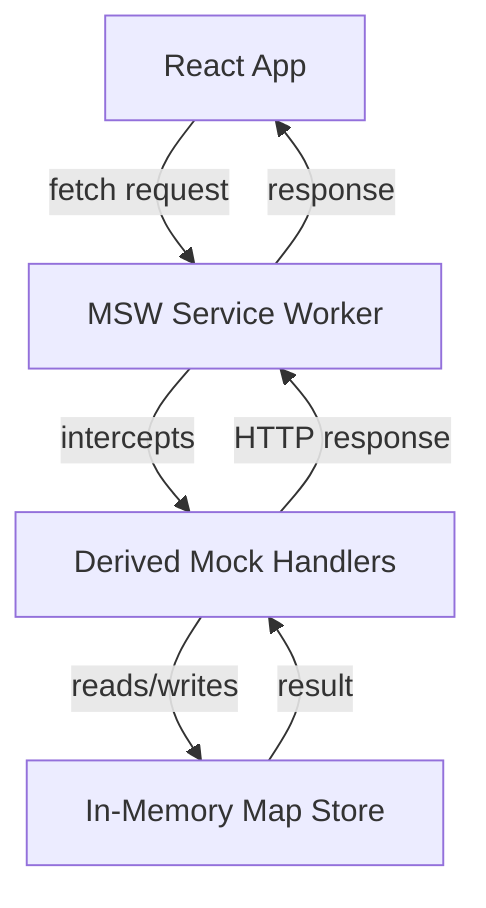

# Mock Data Layer

## Overview

The mock data layer in simplix-react combines MSW (Mock Service Worker) for HTTP request interception with an in-memory Map-based store to create a fully functional API simulation that runs entirely in the browser. Unlike static fixture-based mocking, this approach provides real CRUD operations, filtering, sorting, pagination, and relation loading --- all backed by JavaScript `Map` instances.

The motivation is to eliminate the dependency on a running backend during frontend development. Traditional mocking (hardcoded JSON fixtures, simple request/response maps) breaks down when the frontend needs to create, update, and delete data and see those changes reflected in subsequent queries. A static mock returns the same response regardless of what the frontend sent. The simplix-react mock layer solves this by backing every mock handler with in-memory store operations that maintain state across requests.

This architecture also enables realistic testing scenarios, offline development, and demo environments that behave identically to production --- without any backend infrastructure.

## How It Works

### Architecture

The mock data layer consists of three components that work together:

<!--

-->

1. **MSW Service Worker** --- intercepts all HTTP requests matching the contract's URL patterns
2. **Derived Mock Handlers** --- generated from the API contract, translate HTTP requests into store operations
3. **In-Memory Map Store** --- JavaScript `Map` instances, one per entity, storing records keyed by ID

When the React application makes a fetch request (via the derived client or any HTTP call), MSW intercepts it at the service worker level. The request is routed to the appropriate mock handler, which performs read/write operations against the in-memory store. The result is converted back into an HTTP response and returned to the application. The application cannot distinguish this from a real server response.

### Mock Handler Derivation

`deriveMockHandlers()` reads the contract config and generates MSW handlers for each entity. The process mirrors `deriveClient()` but generates server-side handlers instead of client-side methods:

```ts
import { deriveMockHandlers } from "@simplix-react/mock";

const handlers = deriveMockHandlers(projectApi.config, {
  task: {
    defaultLimit: 20,
    maxLimit: 100,
    defaultSort: "createdAt:desc",
    relations: {
      project: {
        entity: "project",
        localKey: "projectId",
        type: "belongsTo",
      },
    },
  },
});
```

For each entity, handlers are generated based on the operation's CRUD role:

| Handler | Store Operation | Features |
| --- | --- | --- |
| **list** (GET) | Iterate and filter `Map` values | Query-param filtering, sorting, offset pagination, parent scoping |
| **get** (GET) | `Map.get(id)` | Optional `belongsTo` relation loading from related stores |
| **create** (POST) | `Map.set(id, record)` | Auto-generated numeric ID, auto-set `createdAt`/`updatedAt` |
| **update** (PATCH/PUT) | Merge into existing record | Partial updates, automatic `updatedAt` timestamp |
| **delete** (DELETE) | `Map.delete(id)` | Row removal by ID |
| **tree** (GET) | Iterate, then `buildTreeFromFlatRows` | Hierarchical data with `parentId`-based nesting |
| **custom** | User-defined resolver | Full control via `MockEntityConfig.resolvers` |

Store names are auto-derived using the convention `{domain}_{snake_case_entity}` (e.g., entity `task` in domain `project` becomes `project_task`). This can be influenced through the contract's domain configuration.

### Bootstrap Flow

The `setupMockWorker()` function orchestrates the full bootstrap sequence using a domain-based configuration. Each domain groups its own handlers and seed data:

```ts
import { setupMockWorker, deriveMockHandlers } from "@simplix-react/mock";

await setupMockWorker({
  domains: [
    {
      name: "project",
      handlers: deriveMockHandlers(projectApi.config),
      seed: {
        project_tasks: [
          { id: 1, title: "Task 1", status: "open", createdAt: "2025-01-01" },
          { id: 2, title: "Task 2", status: "done", createdAt: "2025-01-02" },
        ],
        project_projects: [
          { id: 1, name: "My Project", createdAt: "2025-01-01" },
        ],
      },
    },
    {
      name: "auth",
      enabled: false, // temporarily disable this domain
      handlers: deriveMockHandlers(authApi.config),
    },
  ],
});
```

The sequence is:

1. Filter domains where `enabled !== false`
2. Reset all in-memory stores (clear all `Map` instances and auto-increment counters)
3. Seed each entity store from domain seed data using `seedEntityStore()`
4. Combine handlers from enabled domains and start the MSW service worker

Seed data is provided as a plain object keyed by store name, where each value is an array of records. The `seedEntityStore` function loads records into the store and automatically sets the auto-increment counter to one past the highest numeric ID found in the seed data.

Each domain can be independently toggled via the `enabled` flag (defaults to `true`), making it easy to disable specific domains during development without removing their configuration.

Unhandled requests (those not matching any handler) are bypassed to the network, allowing the mock layer to coexist with real API calls.

### Error Handling

Mock handlers use a `MockResult<T>` pattern that wraps success and failure outcomes:

```ts
// Success
mockSuccess({ id: 1, title: "My Task" })
// { success: true, data: { ... } }

// Failure
mockFailure({ code: "not_found", message: "project_tasks not found" })
// { success: false, error: { code: "not_found", message: "..." } }
```

Error codes are translated to appropriate HTTP status codes:

| Error Code | HTTP Status |
| --- | --- |
| `not_found` | 404 |
| `unique_violation` | 409 |
| `foreign_key_violation` | 422 |
| (other) | 500 |

## Design Decisions

### Why MSW for HTTP Interception

MSW intercepts requests at the service worker level, which means the application's fetch calls behave identically to production. No special mock client, no dependency injection, no test-only code paths. The application uses the same `deriveClient`-generated HTTP client in both development (with mocks) and production (with real API).

Alternatives considered:

- **Fetch polyfill replacement** --- brittle, breaks with library updates, doesn't work with native `fetch`
- **Proxy server** --- requires running a separate process, adds latency, complicates CI
- **In-memory interceptors** --- don't exercise the full HTTP stack (headers, status codes, content types)

### Why In-Memory Stores Instead of PGlite

The original mock layer used PGlite (an in-browser PostgreSQL implementation via WebAssembly) for data persistence. While this provided real SQL capabilities, it introduced significant complexity:

- **Large bundle size** --- PGlite's WASM binary added substantial weight to development builds
- **Initialization latency** --- starting a WebAssembly PostgreSQL instance takes noticeable time
- **Migration management** --- every schema change required writing and maintaining SQL migration scripts
- **Debugging difficulty** --- data lived in IndexedDB, making it hard to inspect and debug

The in-memory Map-based store eliminates all of these issues. JavaScript `Map` instances are instant to create, trivial to inspect in DevTools, and require zero configuration. Seed data is plain JavaScript objects --- no SQL, no migrations, no schema definitions.

The tradeoff is that data does not persist across page refreshes. In practice, this is acceptable because `setupMockWorker()` re-seeds data on every bootstrap, and the instant startup time makes this imperceptible.

### Why Derivation Over Manual Handler Registration

Mock handlers follow the same derivation pattern as clients and hooks. This means adding a new entity to the contract automatically generates its mock handlers --- no manual registration, no forgotten endpoints. The contract remains the single source of truth for both the client-side and mock-server-side behavior.

## Implications

### For Development Workflow

Developers can build and iterate on the entire frontend without any backend running. The mock layer provides realistic behavior --- creating a task, navigating to a different page, and coming back shows the created task. The instant startup (no WASM initialization, no migrations) means mock bootstrapping adds negligible time to the development server start.

### For Testing

Mock handlers generated from the contract can be used directly in integration tests. Since they back every operation with stateful in-memory stores, tests can verify complex scenarios (create, query, update, verify) without a test server. The `resetStore()` function ensures clean state between test runs.

### For Demo Environments

The mock layer can power standalone demo applications that run entirely in the browser. Seeding the stores with sample data via the `seed` configuration creates a realistic, interactive demo without any infrastructure.

### When to Use Mock-Only vs Full Backend

| Scenario | Recommendation |
| --- | --- |
| Early prototyping, UI design iteration | Mock-only |
| Frontend development before backend is ready | Mock-only |
| Integration tests, CI pipelines | Mock-only |
| Demo / showcase applications | Mock-only |
| E2E tests against real API behavior | Full backend |
| Performance testing, load testing | Full backend |
| Production | Full backend |
