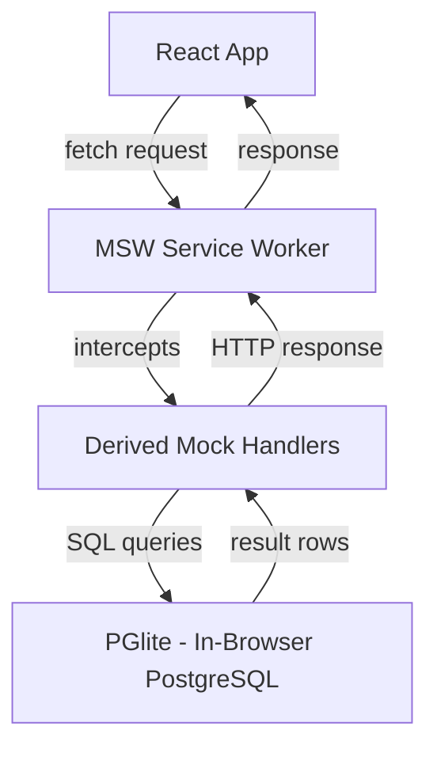

# Mock Data Layer

## Overview

The mock data layer in simplix-react combines two technologies --- MSW (Mock Service Worker) for HTTP request interception and PGlite for in-browser SQL database persistence --- to create a fully functional API simulation that runs entirely in the browser. Unlike static fixture-based mocking, this approach provides a real database with actual CRUD operations, relational integrity, filtering, sorting, and pagination.

The motivation is to eliminate the dependency on a running backend during frontend development. Traditional mocking (hardcoded JSON fixtures, simple request/response maps) breaks down when the frontend needs to create, update, and delete data and see those changes reflected in subsequent queries. A static mock returns the same response regardless of what the frontend sent. The simplix-react mock layer solves this by backing every mock handler with SQL operations against a real database.

This architecture also enables realistic testing scenarios, offline development, and demo environments that behave identically to production --- without any backend infrastructure.

## How It Works

### Architecture

The mock data layer consists of three components that work together:

<!--

-->

1. **MSW Service Worker** --- intercepts all HTTP requests matching the contract's URL patterns
2. **Derived Mock Handlers** --- generated from the API contract, translate HTTP requests into SQL queries
3. **PGlite Database** --- an in-browser PostgreSQL implementation backed by IndexedDB for persistence

When the React application makes a fetch request (via the derived client or any HTTP call), MSW intercepts it at the service worker level. The request is routed to the appropriate mock handler, which translates it into a SQL query against PGlite. The query result is converted back into an HTTP response and returned to the application. The application cannot distinguish this from a real server response.

### Mock Handler Derivation

`deriveMockHandlers()` reads the contract config and generates MSW handlers for each entity. The process mirrors `deriveClient()` but generates server-side handlers instead of client-side methods:

```ts
import { deriveMockHandlers } from "@simplix-react/mock";

const handlers = deriveMockHandlers(projectApi.config, {
  task: {
    tableName: "tasks",
    defaultLimit: 20,
    maxLimit: 100,
    defaultSort: "created_at DESC",
    relations: {
      project: {
        table: "projects",
        localKey: "projectId",
        type: "belongsTo",
      },
    },
  },
});
```

For each entity, five handlers are generated:

| Handler | SQL Operation | Features |
| --- | --- | --- |
| GET list | `SELECT * FROM table` | Filtering, sorting, offset pagination, parent scoping |
| GET by id | `SELECT * FROM table WHERE id = $1` | Optional `belongsTo` relation loading via joins |
| POST create | `INSERT INTO table (...) VALUES (...)` | Auto-generated UUID, parent ID injection, JSONB support |
| PATCH update | `UPDATE table SET ... WHERE id = $1` | Partial updates, automatic `updated_at` timestamp |
| DELETE | `DELETE FROM table WHERE id = $1` | Row removal by ID |

Table names are auto-derived from entity names by converting to snake_case and appending "s" (e.g. `task` becomes `tasks`), but can be overridden via `MockEntityConfig.tableName`.

### PGlite Singleton

PGlite is managed as a singleton initialized once and shared across all handlers:

```ts
import { initPGlite, getPGliteInstance } from "@simplix-react/mock";

// Initialize once (typically during app bootstrap)
const db = await initPGlite("idb://project-mock");

// All handlers use the same instance
const db = getPGliteInstance(); // throws if not initialized
```

The `"idb://..."` prefix tells PGlite to persist data in IndexedDB, meaning data survives page refreshes. This is essential for development workflows where you seed data once and then iterate on the UI without resetting state.

### Bootstrap Flow

The `setupMockWorker()` function orchestrates the full bootstrap sequence using a domain-based configuration. Each domain groups its own handlers, migrations, and seed data:

```ts
import { setupMockWorker, deriveMockHandlers } from "@simplix-react/mock";

await setupMockWorker({
  dataDir: "idb://project-mock",
  domains: [
    {
      name: "project",
      handlers: deriveMockHandlers(projectApi.config),
      migrations: [runProjectMigrations],
      seed: [seedProjectData],
    },
    {
      name: "auth",
      enabled: false, // temporarily disable this domain
      handlers: deriveMockHandlers(authApi.config),
      migrations: [runAuthMigrations],
    },
  ],
});
```

The sequence is:

1. Filter domains where `enabled !== false`
2. Initialize PGlite at the configured data directory
3. Run ALL migration functions across enabled domains sequentially (create tables, alter schemas)
4. Run ALL seed functions across enabled domains sequentially (insert initial data)
5. Combine handlers from enabled domains and start the MSW service worker

All migrations run before any seeds to ensure cross-domain foreign key references are satisfied. For example, if the "auth" domain creates a `users` table and the "project" domain seeds tasks with a `user_id` reference, the `users` table is guaranteed to exist before seeding begins.

Each domain can be independently toggled via the `enabled` flag (defaults to `true`), making it easy to disable specific domains during development without removing their configuration.

Unhandled requests (those not matching any handler) are bypassed to the network, allowing the mock layer to coexist with real API calls.

### SQL Utilities

The mock package provides SQL utilities for working with PGlite:

**Row Mapping** converts between JavaScript camelCase and PostgreSQL snake_case:

- `toCamelCase("created_at")` returns `"createdAt"`
- `toSnakeCase("projectId")` returns `"project_id"`
- `mapRow(dbRow)` converts a full row, auto-converting `_at` suffixed columns to `Date` objects
- `mapRows(dbRows)` maps an array of rows

**Query Building** generates parameterized SQL from update DTOs:

- `buildSetClause({ title: "Updated", status: "done" })` produces `{ clause: "title = $1, status = $2, updated_at = NOW()", values: ["Updated", "done"], nextIndex: 3 }`
- Nested objects are serialized as JSONB automatically
- `updated_at = NOW()` is always appended

**Migration Helpers** provide safe, idempotent schema operations:

- `tableExists(db, "tasks")` checks if a table exists via `information_schema`
- `columnExists(db, "tasks", "priority")` checks if a column exists
- `addColumnIfNotExists(db, "tasks", "priority", "INTEGER DEFAULT 0")` safe column addition
- `executeSql(db, multiStatementString)` splits and executes multiple SQL statements

### Error Handling

Mock handlers use a `MockResult<T>` pattern that wraps success and failure outcomes:

```ts
// Success
mockSuccess({ id: "1", title: "My Task" })
// { success: true, data: { ... } }

// Failure
mockFailure({ code: "not_found", message: "tasks not found" })
// { success: false, error: { code: "not_found", message: "..." } }
```

PostgreSQL errors are mapped to meaningful error codes, which are then translated to appropriate HTTP status codes:

| Error Code | HTTP Status |
| --- | --- |
| `not_found` | 404 |
| `unique_violation` | 409 |
| `foreign_key_violation` | 422 |
| (other) | 500 |

## Design Decisions

### Why MSW for HTTP Interception

MSW intercepts requests at the service worker level, which means the application's fetch calls behave identically to production. No special mock client, no dependency injection, no test-only code paths. The application uses the same `deriveClient`-generated HTTP client in both development (with mocks) and production (with real API).

Alternatives considered:

- **Fetch polyfill replacement** --- brittle, breaks with library updates, doesn't work with native `fetch`
- **Proxy server** --- requires running a separate process, adds latency, complicates CI
- **In-memory interceptors** --- don't exercise the full HTTP stack (headers, status codes, content types)

### Why PGlite for Mock Persistence

PGlite provides a real PostgreSQL engine running in WebAssembly. This means mock handlers can use actual SQL with parameterized queries, foreign key constraints, JSONB columns, and proper transaction semantics. The alternative --- maintaining JavaScript data structures in memory --- would require reimplementing filtering, sorting, pagination, and relational logic from scratch.

PGlite also persists to IndexedDB, meaning mock data survives page refreshes. This is critical for development workflows where you populate data through the UI and then iterate on specific views without constantly re-seeding.

### Why Derivation Over Manual Handler Registration

Mock handlers follow the same derivation pattern as clients and hooks. This means adding a new entity to the contract automatically generates its mock handlers --- no manual registration, no forgotten endpoints. The contract remains the single source of truth for both the client-side and mock-server-side behavior.

### Why Table Names Are Auto-Derived

The convention of converting entity names to snake_case plurals (e.g. `task` becomes `tasks`) eliminates configuration for the common case. When the convention doesn't match (e.g. the table is named `task_items`), the `tableName` override in `MockEntityConfig` provides an escape hatch.

## Implications

### For Development Workflow

Developers can build and iterate on the entire frontend without any backend running. The mock layer provides realistic behavior --- creating a task, navigating to a different page, and coming back shows the created task. This dramatically shortens the feedback loop for UI development.

### For Testing

Mock handlers generated from the contract can be used directly in integration tests. Since they back every operation with real SQL, tests can verify complex scenarios (create, query, update, verify) without a test server.

### For Demo Environments

The mock layer can power standalone demo applications that run entirely in the browser. Seeding the PGlite database with sample data creates a realistic, interactive demo without any infrastructure.

### When to Use Mock-Only vs Full Backend

| Scenario | Recommendation |
| --- | --- |
| Early prototyping, UI design iteration | Mock-only |
| Frontend development before backend is ready | Mock-only |
| Integration tests, CI pipelines | Mock-only |
| Demo / showcase applications | Mock-only |
| E2E tests against real API behavior | Full backend |
| Performance testing, load testing | Full backend |
| Production | Full backend |
