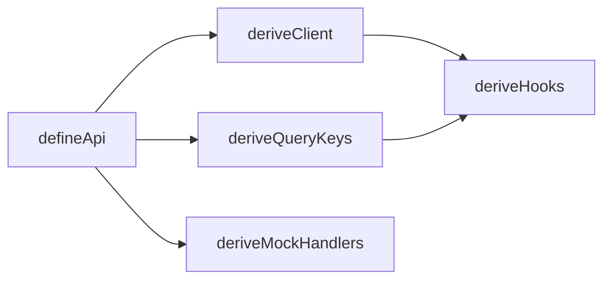

# Schema Derivation

## Overview

Schema derivation is the process by which simplix-react transforms a declarative API contract into executable code --- HTTP clients, query key factories, React Query hooks, and MSW mock handlers. Instead of manually wiring these layers together, you call `defineApi()` once and the framework generates everything from the contract's Zod schemas and path definitions.

The derivation pipeline is the central architectural mechanism of simplix-react. It enforces the invariant that every layer of the stack --- from the HTTP call to the React hook to the mock handler --- agrees on the same types, the same URL structure, and the same validation rules. When you change a Zod schema, every derived artifact updates automatically because they all trace back to the same source definition.

This approach eliminates an entire class of bugs: mismatched types between client and server, forgotten query key updates after renaming an entity, stale mock handlers that no longer match the real API. The derivation pipeline makes these inconsistencies structurally impossible.

## How It Works

The derivation pipeline has five stages, each consuming the contract and producing a different artifact:

<!--

-->

**Contract** → **Client** + **QueryKeys** → **Hooks** → (consumed by React components)

**Contract** → **MockHandlers** → (consumed by MSW service worker)

### Stage 1: defineApi (Contract Assembly)

`defineApi()` is the entry point. It takes an `ApiContractConfig` containing entities, operations, domain name, base path, and an optional query builder. It immediately calls `deriveClient()` and `deriveQueryKeys()`, returning a contract object with three properties: `config`, `client`, and `queryKeys`.

```ts
// packages/contract/src/define-api.ts
export function defineApi(config, options?) {
  return {
    config,
    client: deriveClient(config, options?.fetchFn),
    queryKeys: deriveQueryKeys(config),
  };
}
```

### Stage 2: deriveClient (HTTP Client Generation)

`deriveClient()` iterates over all entities and operations in the config. For each entity, it generates an object with five CRUD methods: `list`, `get`, `create`, `update`, and `delete`. For each operation, it generates a callable function that maps positional arguments to path parameters.

Key behaviors:

- **Parent-aware URL construction** --- if an entity has a `parent` definition, `list` and `create` prepend the parent path segment (e.g. `/projects/:projectId/tasks`)
- **Query parameter serialization** --- the `list` method delegates to the contract's `queryBuilder.buildSearchParams()` for filter, sort, and pagination encoding
- **Content type handling** --- operations with `contentType: "multipart"` automatically convert input to `FormData`; operations with `responseType: "blob"` return binary data
- **Pluggable fetch** --- the `fetchFn` option allows replacing the default HTTP client (e.g. for adding auth headers or retry logic)

```ts
// Entity client shape
api.client.task.list(parentId?, params?)  // GET
api.client.task.get(id)                    // GET /:id
api.client.task.create(parentIdOrDto, dto?) // POST
api.client.task.update(id, dto)            // PATCH /:id
api.client.task.delete(id)                 // DELETE /:id

// Operation client shape
api.client.assignTask(taskId, { userId })  // POST /tasks/:taskId/assign
```

### Stage 3: deriveQueryKeys (Query Key Factory Generation)

`deriveQueryKeys()` iterates over all entity names and creates a `QueryKeyFactory` for each. The factory follows the TanStack Query key factory pattern with a hierarchical structure:

```ts
queryKeys.task.all              // ["project", "task"]
queryKeys.task.lists()          // ["project", "task", "list"]
queryKeys.task.list({ status }) // ["project", "task", "list", { status }]
queryKeys.task.details()        // ["project", "task", "detail"]
queryKeys.task.detail(id)       // ["project", "task", "detail", id]
```

The hierarchy enables granular cache invalidation: invalidating `queryKeys.task.all` clears everything, while invalidating `queryKeys.task.lists()` only clears list queries without touching detail queries.

### Stage 4: deriveHooks (React Query Hook Generation)

`deriveHooks()` from `@simplix-react/react` takes the full contract object (config + client + queryKeys) and generates React Query hooks for each entity and operation.

For entities, six hooks are generated:

| Hook | TanStack Primitive | Purpose |
| --- | --- | --- |
| `useList` | `useQuery` | Fetch a list with optional parent ID, filters, sort, pagination |
| `useGet` | `useQuery` | Fetch a single entity by ID |
| `useCreate` | `useMutation` | Create a new entity, auto-invalidates `keys.all` on success |
| `useUpdate` | `useMutation` | Update an entity, supports optimistic updates, auto-invalidates on settle |
| `useDelete` | `useMutation` | Delete an entity, auto-invalidates `keys.all` on success |
| `useInfiniteList` | `useInfiniteQuery` | Infinite scroll with cursor or offset pagination |

For operations, a single `useMutation` hook is generated with automatic cache invalidation driven by the operation's `invalidates` configuration.

All hooks support full TanStack Query options passthrough --- callers can provide any option except `queryKey`/`queryFn` (for queries) or `mutationFn` (for mutations), which are managed by the derivation layer.

### Stage 5: deriveMockHandlers (MSW Handler Generation)

`deriveMockHandlers()` from `@simplix-react/mock` reads the contract config and generates MSW `http.*` handlers for each entity's CRUD operations. Each handler reads from and writes to an in-memory Map store.

For each entity, five handlers are generated:

- `http.get(listPath)` --- supports filtering, sorting, and pagination via query params
- `http.get(detailPath)` --- supports `belongsTo` relation loading via joins
- `http.post(createPath)` --- auto-generates UUID IDs, handles parent-scoped creation
- `http.patch(updatePath)` --- partial updates with automatic `updated_at` timestamps
- `http.delete(deletePath)` --- removes the row by ID

## Design Decisions

### Why Derivation Over Manual Wiring

Manual wiring means writing the HTTP call, the query key, the React hook, and the mock handler separately for each endpoint. This leads to:

- **Type drift** --- the hook's return type gradually diverges from the actual API response
- **Stale keys** --- query keys are copied and pasted, then forgotten when endpoints change
- **Incomplete mocks** --- mock handlers lag behind real API changes

Derivation eliminates all three problems. Since every artifact traces back to the same Zod schema and path definition, they are structurally forced to agree. The cost is a slightly higher abstraction level, but the reduction in maintenance burden and bug surface area more than compensates.

### Why Each Stage Is a Separate Function

The derivation pipeline is decomposed into independent functions (`deriveClient`, `deriveQueryKeys`, `deriveHooks`, `deriveMockHandlers`) rather than a single monolithic generator. This decomposition enables:

- **Package separation** --- `deriveClient` and `deriveQueryKeys` live in `@simplix-react/contract`, `deriveHooks` lives in `@simplix-react/react`, and `deriveMockHandlers` lives in `@simplix-react/mock`. Consumers only install the packages they need.
- **Tree-shaking** --- if you don't use mocks in production, `@simplix-react/mock` is never bundled.
- **Extensibility** --- new derivation targets can be added as new packages without modifying existing ones.

### Why the Contract Object Bundles Config, Client, and QueryKeys

The `defineApi()` return value bundles all three because downstream consumers need different subsets. `deriveHooks()` needs all three (config for entity definitions, client for query/mutation functions, queryKeys for cache management). `deriveMockHandlers()` only needs config. Bundling them together means you pass a single object everywhere, and TypeScript ensures the types flow through correctly.

## Implications

### Adding a New Entity

Adding a new entity to your API surface requires exactly one change: add an entry to the `entities` object in your `ApiContractConfig`. The derivation pipeline automatically generates the client methods, query keys, hooks, and mock handlers. No manual registration, no code generation step, no boilerplate.

### Changing a Schema

Changing a Zod schema (e.g. adding a field to `updateSchema`) immediately propagates as TypeScript errors to every component that uses the derived `useUpdate` hook with an incompatible DTO shape. The feedback loop is instantaneous --- you change the schema, the compiler tells you what else needs to change.

### Adding Custom Behavior

The derivation pipeline generates standard behavior. When you need custom logic (e.g. a complex query that joins multiple entities, a mutation with side effects beyond cache invalidation), you define it as an `OperationDefinition` with explicit input/output schemas and an `invalidates` function. The operation integrates into the same derivation pipeline without special-casing.
